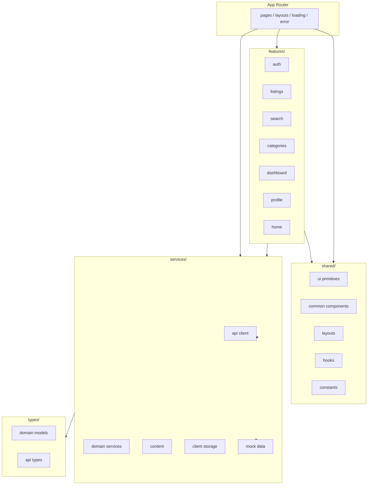

# Sooqna — Frontend Architecture

## Overview

Sooqna (`sooqna-web`) is a production-oriented Next.js 16 App Router frontend for an Arabic RTL classifieds marketplace. The application is designed for backend integration: pages and components consume data exclusively through typed service modules, with no inline mock data in UI code.

**Stack:** Next.js 16 · React 19 · TypeScript · Tailwind CSS 4 · Turbopack

## Architectural Principles

1. **Feature-first organization** — Domain UI lives under `features/<domain>/`. Cross-cutting primitives live under `shared/`.
2. **Service boundary** — All data access flows through `services/`. Components never import mock files directly.
3. **Type safety** — Domain models in `types/domain/` with barrel exports from `types/index.ts`. No `any`.
4. **Server-first rendering** — Pages are async Server Components where possible; client components are scoped to interactivity.
5. **Graceful degradation** — Loading skeletons, error boundaries, offline banner, and retry affordances at route and component level.

## Layer Diagram



## Directory Responsibilities

| Layer | Path | Responsibility |
|-------|------|----------------|
| Routes | `app/` | URL mapping, metadata, route-level loading/error/not-found |
| Features | `features/<name>/` | Domain-specific components, hooks, and barrels |
| Shared | `shared/` | Reusable UI, layouts, hooks, constants |
| Services | `services/` | Data access, API client, mock implementations |
| Types | `types/` | Domain models and API contracts |

## Data Flow

### Server Components (default)

```
Page (async) → service function → domain type → feature component props
```

Example: `app/page.tsx` calls `getCategories()`, `getFeaturedListings()`, and passes typed results to home feature components.

### Client Components

```
Client component → hook / service → local state → UI
```

Example: `SearchResultsList` uses `useMarketplaceSearch` which calls listing search logic. `AddListingForm` uses `useAddListingForm` and persists via `services/storage`.

### Session & Local Data

User session and user-created listings are stored in `localStorage` via `services/storage/client-storage.ts`. This layer will be replaced by authenticated API calls when the backend is available.

## Error Handling Strategy

| Concern | Implementation |
|---------|----------------|
| Route errors | `app/error.tsx`, route-specific `error.tsx` files |
| Global crashes | `app/global-error.tsx` |
| 404 | `app/not-found.tsx` |
| API errors | `ApiError` class in `services/api/errors.ts` |
| User-facing retry | `shared/components/ErrorState.tsx` |
| Offline | `shared/components/OfflineBanner.tsx` + `useOnlineStatus` |
| Component isolation | `shared/components/ErrorBoundary.tsx` |

## Performance

- **Code splitting:** Heavy client forms (e.g. `AddListingForm`) loaded via `next/dynamic`.
- **Image optimization:** `shared/components/AppImage.tsx` wraps `next/image` with fallback UI.
- **Memoization:** `ListingCard` wrapped in `React.memo`.
- **Remote images:** `next.config.ts` configures `images.remotePatterns` for Unsplash.

## Accessibility

- RTL layout with `lang="ar"` and `dir="rtl"` on `<html>`.
- Focus rings via `focus-ring` utility class.
- `aria-busy` on loading buttons, `aria-pressed` on category selectors.
- Screen-reader labels on icon-only controls and image fallbacks.
- Semantic landmarks: `<main>`, `role="alert"` on error states.

## Backend Integration Readiness

The mock service layer mirrors the shape expected from a real API:

- Async functions returning `Promise<T>` for all reads/writes.
- `apiClient` ready in `services/api/client.ts` (activated by `NEXT_PUBLIC_API_BASE_URL`).
- Legacy shim files (`listingsService.ts`, etc.) re-export new modules for gradual migration.

See [API_INTEGRATION_GUIDE.md](./API_INTEGRATION_GUIDE.md) for the step-by-step swap plan.

## Out of Scope (Current Sprint)

Wallet, Escrow, Checkout, and Chat remain placeholder routes (`ComingSoonPage`). These are intentionally not implemented until the backend payment/escrow APIs exist.

## Validation

```bash
npm run lint    # ESLint
npm run build   # Production build
npm run dev     # Local development on :3000
```

No automated test suite is configured. Validate changes via lint, build, and manual browser testing.
